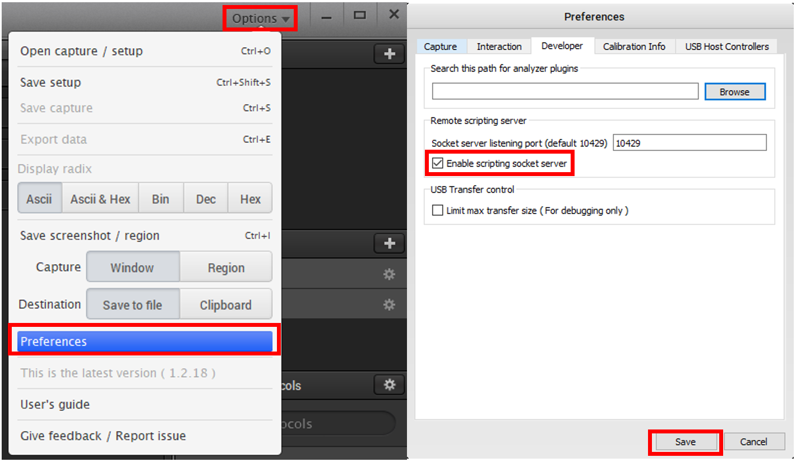
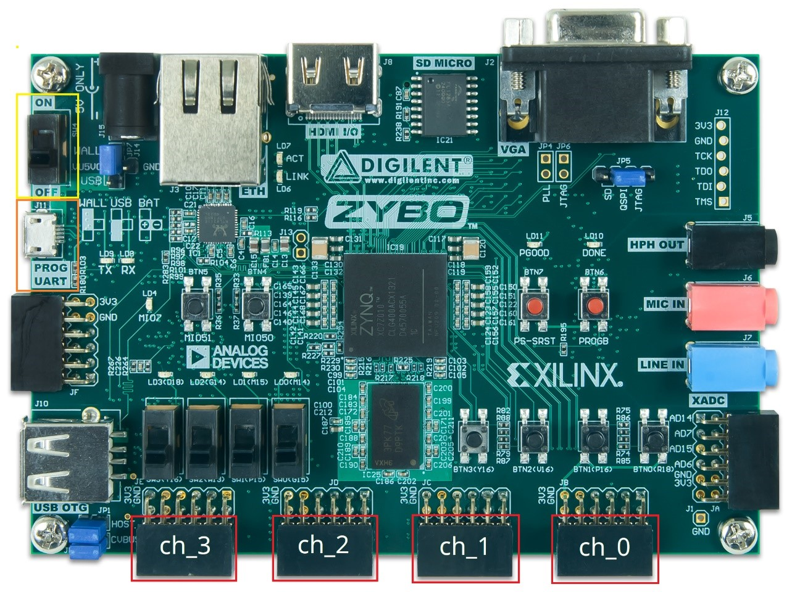
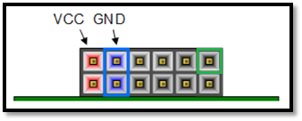

# CAERUS

The controller software for the CAERUS project, a toolset for reverse engineering legacy embedded systems.

# Installing

## Pre-requisite Software

* Windows (recommended)
* Python 3 (https://www.python.org/downloads/)
	* Check "Add Python to PATH"
	* Ensure Python's pip package manager is installed (enabled by default under "Customize Installation")
* Saleae Logic Software (https://www.saleae.com/downloads/)
* Git (optional)

## Installing CAERUS

1. Clone the CAERUS controller software repository using git, or download a zipped archive from the repository
2. Navigate to the top-level of the controller software repository
3. Run the command `pip install -r requirements.txt` to install the required Python libraries
4. Open the Saleae Logic Software

*Figure 1. Enabling Saleae Logic Software scripting socket server*

5. Open the "Options" menu, select "Preferences", select the "Developer" tab, and check the "Enable scripting socket server" check box, shown in Figure 1
6. Click the "Save" button

# Using CAERUS

## Hardware Setup

*Figure 2: Zybo board*

1. Ensure the board power switch is set to ON position (Switch outlined in Yellow in Figure 2)
2. Connect micro side of the USB-A to USB-micro cable (Port outlined in Orange in Figure 2)
3. Connect USB-A side of the USB-A to USB-micro to an available USB port on PC

*Figure 3: Zybo Pmod Port Interface (Outlined in Red in Figure 2)*

4. CAERUS produces signals on the pin outlined in Green in Figure 3 for each channel in Figure 2; this pin should be used to connect to target device inputs. 
5. Connect the GND pin outlined in Blue in Figure 3 to the target device for a common ground
6. Connect the Saleae Logic Analyzer via USB to an available USB port on PC
7. When connecting the Saleae Logic Analyzer to a target device, ensure a ground pin is connected

## Software Startup

1. Open the Saleae Logic Software
2. Ensure the Zybo board has been programmed. See section titled "Ephemerally Programming the Zybo board"
3. Open the Controller Software
	* Open the Windows command prompt or other terminal emulator
	* Navigate to the top-level of the controller software repository
	* Run with the command 	`python -m controller [saved profile]`

## Software Usage

### Tips & Tricks

* If the software crashes, it will attempt to save a profile in the current directory named _crash_[current date].profile. This profile can be loaded to resume work. 
* When defining a signal, it uses the global sample rate setting. Set the global sample rate setting with the sample command before defining any signals; it defaults to 25 MHz in a new profile, which is too fast for most signals.

### Errata

* A bug in the HDL implementation currently results in a hang when any channel other than I1 is selected as the "stop channel" or the channel whose address is observed as the condition to stop playback. This results in the software waiting forever to playback to finish. To avoid this, ensure the test set-up always has a non-looping signal with the shortest-duration signal on I1.
* A bug exists where using sample rates below 200 Hz usually results in incorrect playback. Use higher sample rates (> 300 Hz?) to avoid this.